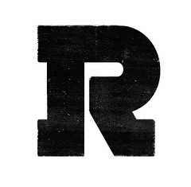
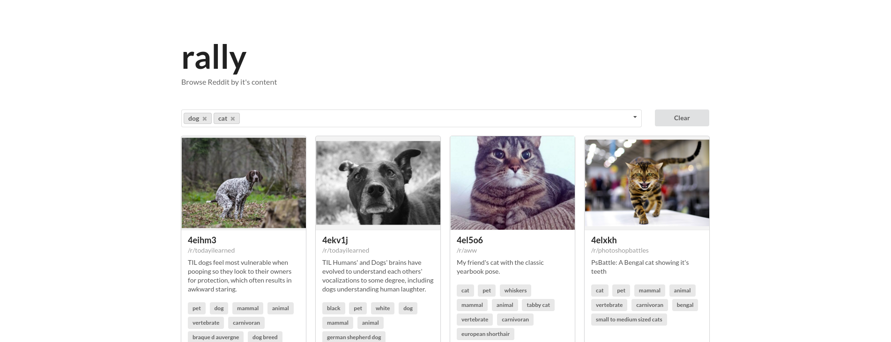

# 

# RallySearch

## Overview
RallySearch is an alternative way of consuming Reddit. As Redditors all know, search functionality within the site is rather lackluster. This prototype project aims to offer an alternative to browsing Reddit by it's *content* in a visually pleasing and simple fashion.

Top media posts on Reddit are sent through [Google's Cloud Vision](https://cloud.google.com/vision/) (Image recognition API) and results are cached. Upon giving each image (or preview in the case of videos and gifs) labels, users can easily view similar content by selecting the desired tag(s).

This project is part of a larger project aimed towards generating insights and analytics towards Reddit data for my undergraduate [honours thesis](https://github.com/kevineger/rally). **RallySearch** is designed to be slim with limited yet effective functionality.

# 

## Contributing
1. Fork it
2. Create your feature branch: `git checkout -b my-new-feature`
3. Commit your changes: `git commit -am 'Add some feature'`
4. Push to the branch: `git push origin my-new-feature`
5. Submit a pull request

## License

Rallysearch is open-sourced software licensed under the [MIT license](http://opensource.org/licenses/MIT).
